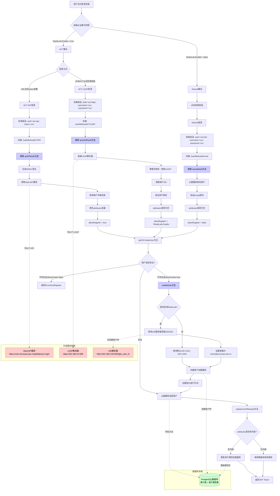

# ACT LDAP 认证流程

本文档记录了 Crater 项目中与 RAIDS Lab 实验室 ACT LDAP 认证系统相关的认证流程、用户管理和依赖关系。

## 更新记录

> **2025-12-24** | [chore: format translation in pre-commit hook (#315)](https://github.com/raids-lab/crater/commit/518c88705ec7462f6c5d06d24a7aa70d7607f8b0) | `518c887`  
> 总结当前系统的三种认证方式（Normal、ACT-LDAP、ACT-API）的完整流程，包括用户创建、状态管理、权限分配和外部服务依赖关系。补充LDAP请求时机和数据说明、密码存储策略、ACT-API数据库更新机制，明确ACT-LDAP仅用于密码验证，ACT-API通过OpenAPI服务获取信息而非直接调用LDAP。

## 认证方式概览

Crater 系统支持三种用户认证方式，根据配置中的 `RaidsLab.Enable` 标志决定可用模式：

- **Normal 认证**：本地用户名密码验证，适用于独立部署场景
- **ACT-LDAP 认证**：通过实验室 LDAP 服务器进行身份验证，仅进行认证不获取用户详细信息
- **ACT-API 认证**：通过实验室封装的 OpenAPI 服务进行 token 验证并获取完整用户信息

## LDAP 认证机制

### LDAP 基础概念

LDAP（Lightweight Directory Access Protocol）是一种分布式目录信息服务协议，采用树状结构（DIT - Directory Information Tree）存储数据。每个节点都有唯一的 DN（Distinguished Name），可以包含多个属性（Attributes）。

**关键特性**：
- 搜索时不需要提供完整的 DN 路径，只需提供属性键值对
- LDAP 服务器会根据搜索范围（Scope）自动匹配
- 所有节点都可以包含属性，不仅仅是叶子节点
- 搜索条件中的属性如果不存在，该条目会被过滤掉

### ACT-LDAP 认证流程

ACT-LDAP 认证采用**两步绑定**机制：

1. **管理员绑定**：使用配置的 LDAP 管理员账号（`it@lab`）登录 LDAP 服务器，获取搜索权限
2. **用户搜索**：在指定的搜索基准 DN（`OU=Lab,OU=ACT,DC=lab,DC=act,DC=buaa,DC=edu,DC=cn`）下搜索用户
3. **用户验证**：使用搜索到的用户 DN 和用户提供的密码进行二次绑定验证

**关键限制**：ACT-LDAP 认证仅返回用户的 DN，不获取用户的详细信息（姓名、邮箱、组别等）。这些信息需要从系统数据库中读取历史数据。

## 认证流程详解



### 统一登录入口

所有认证方式都通过 `backend/internal/handler/auth.go` 的 `Login` 函数统一处理，根据请求中的 `AuthMethod` 字段分发到不同的认证方法。

### ACT-API 认证流程

ACT-API 认证通过实验室封装的 OpenAPI 服务进行，该服务提供了完整的用户信息同步接口。

**流程步骤**：
1. 前端检测到 URL 中包含 `token` 参数时，自动使用 ACT-API 方式登录
2. 后端生成 HMAC-SHA256 签名（使用 `AccessToken` 作为密钥）
3. 调用 OpenAPI 服务（`https://user.act.buaa.edu.cn/api/lab/sync.login`）
4. 解析返回的用户详细信息（账号、姓名、邮箱、导师、组别、过期时间）
5. 填充 `UserAttribute` 结构体
6. 设置 `allowRegister = true`，允许创建新用户

**用户信息获取**：ACT-API 返回完整的用户属性，包括 `Name`、`Nickname`、`Email`、`Teacher`、`Group`、`ExpiredAt`。

**重要说明**：ACT-API **不直接调用LDAP服务器**，而是通过OpenAPI服务（`https://user.act.buaa.edu.cn/api/lab/sync.login`）获取用户信息。OpenAPI服务可能内部会查询LDAP，但Crater系统本身不直接与LDAP交互。

### ACT-LDAP 认证流程

ACT-LDAP 认证直接连接 LDAP 服务器，仅进行身份验证。

**流程步骤**：
1. 前端在 ACT 模式下，用户点击"ACT认证登录"按钮
2. 后端连接 LDAP 服务器（`ldap://192.168.0.10:389`），旧的 LDAP 服务器（`192.168.0.9` 因为磁盘故障而宕机）
3. 使用管理员账号绑定（`it@lab` / `activic123`）
4. 在搜索基准 DN 下搜索用户（使用 `sAMAccountName` 属性）
5. 获取用户 DN 并使用用户密码进行验证
6. `UserAttribute` 保持为空
7. 设置 `allowRegister = !RaidsLab.Enable`（如果启用 RaidsLab，则不允许注册）

**用户信息获取**：ACT-LDAP **仅从LDAP获取用户DN用于密码验证**，不获取用户的姓名、邮箱、组别等详细信息。这些信息需要从系统数据库中读取历史数据（通常来自之前ACT-API登录时存储的数据）。

### Normal 认证流程

Normal 认证是纯本地验证，不依赖任何外部服务。

**流程步骤**：
1. 前端在 Normal 模式下，用户输入用户名密码
2. 后端从数据库查询用户
3. 使用 bcrypt 验证密码哈希
4. `UserAttribute` 保持为空
5. `allowRegister = false`，不允许创建新用户

## 用户创建与状态管理

### 用户创建机制

所有新用户创建都通过 `createUser` 函数统一处理，该函数会：

1. **UID/GID 分配**：
   - 如果 `RaidsLab.Enable = true`：调用 UID 服务器（`http://192.168.5.59:5000/get_user_id`）获取 UID/GID
   - 如果 `RaidsLab.Enable = false`：使用默认值 UID=1001, GID=1001

2. **用户状态**：所有新创建的用户都设置为 `StatusActive`（激活状态），与认证方式无关

3. **用户角色**：所有新创建的用户都设置为 `RoleUser`（普通用户），需要管理员手动提升为管理员

4. **密码存储策略**：
   - **ACT-LDAP 和 ACT-API**：不存储密码（`Password = nil`），因为依赖外部认证系统
   - **Normal 注册**：存储密码（使用 bcrypt 加密），因为需要本地密码验证
   - 代码实现：`createUser` 函数接收 `password *string` 参数，ACT-LDAP 和 ACT-API 登录时传入 `nil`，只有 Normal 注册时传入实际密码

5. **默认队列**：自动创建用户与默认账户（`default`）的关联关系，访问模式为只读（`AccessModeRO`）

### 用户状态检查

登录流程中有一个关键的状态检查点：

```go
if user.Status != model.StatusActive {
    resputil.HTTPError(c, http.StatusUnauthorized, "User is not active", resputil.NotSpecified)
    return
}
```

**状态类型**：
- `StatusPending`（1）：待激活状态，无法登录
- `StatusActive`（2）：激活状态，可以正常登录
- `StatusInactive`（3）：禁用状态，无法登录

**重要发现**：
- 用户状态是系统内部状态，与 LDAP 服务无关
- 目前系统不支持管理员修改用户状态（没有相应的 API 接口）
- 所有新创建的用户都是激活状态，设计理念是"认证即激活"

## 用户信息管理

### UserAttribute 结构

用户详细信息存储在 `UserAttribute` 结构体中，作为 JSON 字段存储在数据库的 `attributes` 列：

```go
type UserAttribute struct {
    Name      string   // 账号
    Nickname  string   // 昵称
    Email     *string  // 邮箱
    Teacher   *string  // 导师
    Group     *string  // 课题组
    ExpiredAt *string  // 过期时间
    Phone     *string  // 电话
    Avatar    *string  // 头像
    UID       *string  // UID（用于文件系统）
    GID       *string  // GID（用于文件系统）
}
```

### 用户信息更新机制

`updateUserIfNeeded` 函数负责更新用户属性，采用以下策略：

1. **邮箱保护机制**：如果数据库中已存在邮箱，则不会更新为新邮箱（防止外部服务随意修改）
2. **属性合并**：保留现有头像、UID、GID，更新其他属性
3. **更新条件**：只有当 `attributes` 有内容（通常来自 ACT-API）时才会更新数据库

**ACT-API 登录时的数据库更新**：
- ACT-API 登录时，`actAPIAuth` 函数会填充完整的 `attributes`（账号、姓名、邮箱、导师、组别、过期时间）
- `updateUserIfNeeded` 函数检测到 `attributes` 包含 Email 时，会更新数据库：
  - 更新 `attributes` 字段（JSON格式的用户属性）
  - 更新 `nickname` 字段
- **更新条件**：用户已存在且新数据与现有数据不同
- **邮箱保护**：如果数据库中已有邮箱，`updateUserIfNeeded` 会保留旧邮箱（但管理员可以通过 `UpdateUserAttributesByAdmin` 直接覆盖）

**数据流向**：
- **ACT-API 登录**：OpenAPI 服务 → 完整 attributes → **更新数据库** → 前端显示
- **ACT-LDAP 登录**：LDAP 认证 → 空 attributes → 从数据库读取历史数据 → 前端显示（**不更新数据库**）
- **Normal 登录**：本地认证 → 空 attributes → 从数据库读取历史数据 → 前端显示（**不更新数据库**）

## 外部服务依赖

### LDAP 服务器

- **地址**：`ldap://192.168.0.10:389`
- **管理员账号**：`it@lab` / `activic123`
- **搜索基准 DN**：`OU=Lab,OU=ACT,DC=lab,DC=act,DC=buaa,DC=edu,DC=cn`
- **用途**：身份认证、用户搜索
- **返回数据**：仅用户 DN

**重要限制**：
- **仅返回DN**：LDAP搜索请求中明确指定只返回 `dn` 属性，不返回用户的姓名、邮箱、组别等其他信息
- **仅用于认证**：LDAP服务仅用于验证用户身份，不用于获取用户详细信息
- **不缓存连接**：每次认证都会重新建立LDAP连接，认证完成后连接关闭
- **ACT-API不调用LDAP**：ACT-API认证通过OpenAPI服务获取用户信息，不直接调用LDAP服务器

### OpenAPI 服务

- **地址**：`https://user.act.buaa.edu.cn/api/lab/sync.login`
- **认证方式**：HMAC-SHA256 签名（使用 `ChameleonKey` 和 `AccessToken`）
- **用途**：Token 验证、获取完整用户信息
- **返回数据**：账号、姓名、邮箱、导师、组别、过期时间

### UID 服务器

- **地址**：`http://192.168.5.59:5000/get_user_id`
- **用途**：为新用户分配 UID/GID（仅在 `RaidsLab.Enable = true` 时使用）
- **调用时机**：仅在创建新用户时调用

## 管理员权限管理

### 成为管理员的途径

1. **系统初始化**：通过环境变量 `CRATER_ADMIN_USERNAME` 和 `CRATER_ADMIN_PASSWORD` 创建初始管理员
2. **权限提升**：现有管理员通过用户管理界面提升其他用户为管理员（`PUT /api/v1/admin/users/{name}/role`）

### 管理员功能

管理员可以：
- ✅ 查看用户列表
- ✅ 修改用户角色（普通用户 ↔ 管理员）
- ✅ 修改用户属性（昵称、邮箱、导师、组别、电话等）
- ✅ 删除用户
- ❌ **不能修改用户状态**（没有相应的 API 接口）
- ❌ **不能直接创建用户**（只能通过登录流程创建）

**用户属性修改位置**：
- **后端API**：`PUT /api/v1/admin/users/{name}/attributes`（`backend/internal/handler/user.go` 的 `UpdateUserAttributesByAdmin` 函数）
- **前端界面**：管理员用户管理页面（`frontend/src/routes/admin/users/index.tsx`），点击用户操作菜单中的"编辑信息"按钮，打开 `UserEditDialog` 对话框
- **可修改字段**：昵称（nickname）、邮箱（email）、导师（teacher）、组别（group）、电话（phone）

**注意**：管理员修改用户属性时，会直接覆盖整个 `UserAttribute` 对象，**没有邮箱保护机制**（与登录时的 `updateUserIfNeeded` 函数不同），因此管理员可以修改任何属性，包括邮箱。

## 关键设计决策

### 为什么 ACT-LDAP 不获取用户详细信息？

当前实现中，ACT-LDAP 认证仅返回用户的 DN，不获取用户的详细信息。这种设计可能是为了：

1. **简化认证流程**：减少 LDAP 查询的复杂度
2. **依赖历史数据**：依赖之前通过 ACT-API 登录时存储的用户信息
3. **性能考虑**：避免每次登录都查询完整的用户属性

### 为什么所有新用户都是激活状态？

系统采用"认证即激活"的设计理念：

1. **简化管理**：避免复杂的用户激活流程
2. **即用即得**：用户创建后立即可用
3. **安全基础**：外部认证系统（LDAP/OpenAPI）已经验证了用户身份

### 为什么邮箱有保护机制？

`updateUserIfNeeded` 函数中有邮箱保护逻辑，防止已存在的邮箱被覆盖：

1. **身份稳定性**：邮箱是重要的身份标识
2. **防止误操作**：避免外部服务随意修改用户邮箱
3. **数据保护**：保护用户隐私和账户安全

## 解耦方向

当前系统对实验室内部服务存在以下依赖：

1. **OpenAPI 服务**：用于获取用户详细信息
2. **UID 服务器**：用于分配 UID/GID
3. **LDAP 服务器**：用于身份认证

**解耦目标**：
- 直接从 LDAP 获取用户详细信息，移除对 OpenAPI 的依赖
- 本地生成 UID/GID，移除对 UID 服务器的依赖
- 提供配置化的 LDAP 属性映射，支持不同的 LDAP 数据字段设置