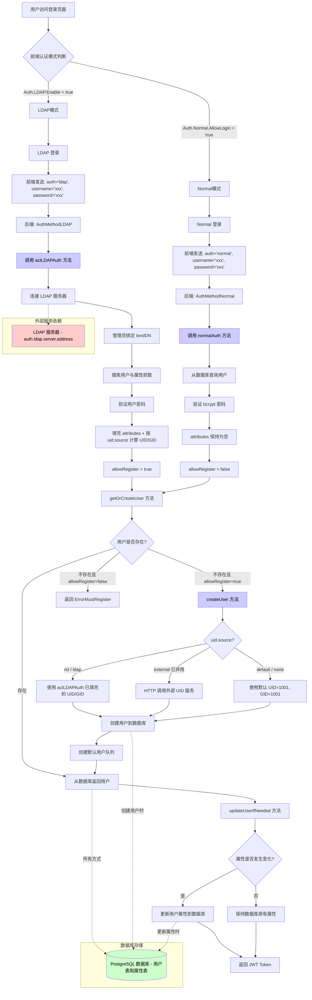

# ACT LDAP 认证流程

本文档记录了 Crater 项目中与 RAIDS Lab 实验室 ACT LDAP 认证系统相关的认证流程、用户管理和依赖关系。

## 更新记录

> **2026-05-19** | [Merge pull request #404 from AkashiSensei/feat/cli-init](https://github.com/raids-lab/crater/commit/e131fbc219d149fd99dfb75b47875d8933f544a2) | `e131fbc`  
> 对齐当前实现，将 ACT 环境的 UID/GID 分配机制从外部 UID 服务迁移为 `rid` 本地计算方案。重绘认证流程图，明确 UID/GID 在 `actLDAPAuth` 阶段完成；补充 `uid.source` 策略对照表、`rid` 配置项与算法说明；将 Winbind / 59 节点内容调整为存储侧背景与历史方案；更新外部服务依赖与解耦章节，反映 Crater 现仅依赖 LDAP 即可完成认证与身份映射。

> **2026-03-01** | [refactor: decoupling ACT OpenAPI (#347)](https://github.com/raids-lab/crater/commit/c1c8031f9f8b2b609133c1539586dda965657878) | `c1c8031`  
> 补充了 ACT UID 的生成与获取逻辑，详细记录了 Winbind 的 RID 算法原理。新增了通过 LDAP `objectSid` 属性手动计算 UID 的方法，并记录了通过直接解析 SID 移除对外部 UID 查询服务（59 节点）依赖的可行性方案。

> **2026-02-14** | [refactor: decoupling ACT OpenAPI (#347)](https://github.com/raids-lab/crater/commit/c1c8031f9f8b2b609133c1539586dda965657878) | `c1c8031`  
> 更新文档以反映系统架构变化，记录解除对 ACT OpenAPI 服务依赖后的认证流程，强调 LDAP 认证现在可直接从 LDAP 服务器获取完整用户信息。

> **2025-12-24** | [chore: format translation in pre-commit hook (#315)](https://github.com/raids-lab/crater/commit/518c88705ec7462f6c5d06d24a7aa70d7607f8b0) | `518c887`  
> 总结当前系统的三种认证方式（Normal、ACT-LDAP、ACT-API）的完整流程，包括用户创建、状态管理、权限分配和外部服务依赖关系。补充LDAP请求时机和数据说明、密码存储策略、ACT-API数据库更新机制，明确ACT-LDAP仅用于密码验证，ACT-API通过OpenAPI服务获取信息而非直接调用LDAP。

## 认证方式概览

Crater 系统支持两种主要的用户认证方式，根据配置中的 `auth` 模块决定可用模式：

- **Normal 认证**：本地用户名密码验证，适用于独立部署场景。可配置是否允许登录（`auth.normal.allowLogin`）及是否允许公开注册（`auth.normal.allowRegister`）。
- **LDAP 认证**：通过 LDAP 服务器进行身份验证。系统能够根据配置的属性映射（`auth.ldap.attributeMapping`）直接从 LDAP 获取用户的详细信息（如姓名、邮箱、导师、过期时间等），不再依赖外部 OpenAPI 服务。

此外，系统支持多种 UID/GID 获取策略（`auth.ldap.uid.source`）：

| `source` 值 | 行为 | 适用场景 |
|---|---|---|
| `default` / `none` | 使用固定默认值 UID=1001、GID=1001 | 标准 NFS 或本地存储 |
| `ldap` | 从 LDAP 指定属性（如 `uidNumber` / `gidNumber`）读取 | 已配置 POSIX 属性的目录 |
| `rid` | 从 LDAP 二进制 `objectSid` 和 `primaryGroupID` 本地计算 | Windows AD + Winbind 环境（**ACT 推荐**） |
| `external` | 调用外部 HTTP 服务获取（**已弃用**） | 仅用于兼容历史部署 |

Legacy token 登录（原 ACT-API 方式）已在 `Login` 入口明确拒绝，错误提示为 `Legacy token login is no longer supported`。

## LDAP 认证机制

### LDAP 基础概念

LDAP（Lightweight Directory Access Protocol）是一种分布式目录信息服务协议，采用树状结构（DIT - Directory Information Tree）存储数据。每个节点都有唯一的 DN（Distinguished Name），可以包含多个属性（Attributes）。

**关键特性**：
- 搜索时不需要提供完整的 DN 路径，只需提供属性键值对
- LDAP 服务器会根据搜索范围（Scope）自动匹配
- 所有节点都可以包含属性，不仅仅是叶子节点
- 搜索条件中的属性如果不存在，该条目会被过滤掉

### LDAP 认证流程

LDAP 认证采用**两步绑定**机制：

1. **管理员绑定**：使用配置的 LDAP 管理员账号（`bindDN`）登录 LDAP 服务器，获取搜索权限。
2. **用户搜索**：在指定的搜索基准 DN（`baseDN`）下，根据用户名映射字段（`attributeMapping.username`）搜索用户。
3. **用户验证与属性获取**：使用搜索到的用户 DN 和用户提供的密码进行二次绑定验证。验证成功后，系统会根据 `attributeMapping` 配置抓取用户的详细属性（姓名、邮箱、导师、组别等）。

**核心改进**：重构后的 LDAP 认证不再仅仅返回 DN，而是能够同步完整的用户信息。这些信息会根据同步策略更新到系统数据库中。

## 认证流程详解


```mermaid
graph TD
    A[用户访问登录页面] --> B{前端认证模式判断}
    
    B -->|Auth.LDAP.Enable = true| C[LDAP模式]
    B -->|Auth.Normal.AllowLogin = true| D[Normal模式]
    
    C --> G[LDAP 登录]
    D --> I[Normal 登录]
    
    %% LDAP 流程
    G --> G1[前端发送: auth='ldap', username='xxx', password='xxx']
    G1 --> G2[后端: AuthMethodLDAP]
    G2 --> G3[调用 actLDAPAuth 方法]
    G3 --> G4[连接 LDAP 服务器]
    G4 --> G5[管理员绑定 bindDN]
    G5 --> G6[搜索用户与属性抓取]
    G6 --> G7[验证用户密码]
    G7 --> G8[填充 attributes + 按 uid.source 计算 UID/GID]
    G8 --> G9[allowRegister = true]
    
    %% Normal 流程
    I --> I1[前端发送: auth='normal', username='xxx', password='xxx']
    I1 --> I2[后端: AuthMethodNormal]
    I2 --> I3[调用 normalAuth 方法]
    I3 --> I4[从数据库查询用户]
    I4 --> I5[验证 bcrypt 密码]
    I5 --> I6[attributes 保持为空]
    I6 --> I7[allowRegister = false]
    
    %% 共同流程
    G9 --> J[getOrCreateUser 方法]
    I7 --> J
    
    J --> K{用户是否存在?}
    K -->|存在| L[从数据库返回用户]
    K -->|不存在且 allowRegister=true| M[createUser 方法]
    K -->|不存在且 allowRegister=false| N[返回 ErrorMustRegister]
    
    M --> M1{uid.source?}
    M1 -->|rid / ldap| M2[使用 actLDAPAuth 已填充的 UID/GID]
    M1 -->|external 已弃用| M2b[HTTP 调用外部 UID 服务]
    M1 -->|default / none| M3[使用默认 UID=1001, GID=1001]
    
    M2 --> M5[创建用户到数据库]
    M2b --> M5
    M3 --> M5
    
    M5 --> M6[创建默认用户队列]
    M6 --> L
    
    L --> O[updateUserIfNeeded 方法]
    O --> P{属性是否发生变化?}
    P -->|是| Q[更新用户属性到数据库]
    P -->|否| R[保持数据库原有属性]
    Q --> S[返回 JWT Token]
    R --> S
    
    %% 外部服务
    subgraph "外部服务依赖"
        EXT2[LDAP 服务器 - auth.ldap.server.address]
    end
    
    %% 数据库
    subgraph "数据库存储"
        DB[(PostgreSQL 数据库 - 用户表和属性表)]
    end
    
    %% 依赖关系
    G4 -.-> EXT2
    
    L -.->|所有方式| DB
    M5 -.->|创建用户时| DB
    Q -.->|更新属性时| DB
    
    %% 样式
    classDef external fill:#ffcccc,color:#000000
    classDef database fill:#ccffcc,color:#000000
    classDef process fill:#ccccff,color:#000000
    
    class EXT2 external
    class DB database
    class G3,I3,M process
```

### 统一登录入口

所有认证方式都通过 `backend/internal/handler/auth.go` 的 `Login` 函数统一处理，根据请求中的 `AuthMethod` 字段分发到不同的认证方法。若请求携带 legacy `token` 字段，直接返回 403。

### LDAP 认证流程

LDAP 认证直接连接 LDAP 服务器进行身份验证，并根据配置的映射同步用户信息。核心逻辑在 `actLDAPAuth` 中实现。

**流程步骤**：
1. 前端在 LDAP 模式下，用户输入用户名和密码并点击登录。
2. 后端使用 `github.com/go-ldap/ldap/v3` 连接 LDAP 服务器。
3. 使用管理员账号（`bindDN` / `bindPassword`）进行初始绑定。
4. 在搜索基准 DN（`baseDN`）下搜索用户，搜索条件基于 `attributeMapping.username`。`prepareLDAPAttributes` 会根据 `uid.source` 追加所需属性（`rid` 模式下追加 `objectSid` 和 `primaryGroupID`）。
5. 获取用户 DN 后，使用用户提供的密码进行 Bind 操作以验证密码。
6. **属性同步**：根据 `attributeMapping` 配置，从 LDAP 结果中抓取 `DisplayName`、`Email`、`Teacher`、`Group`、`Phone`、`ExpiredAt` 等字段。
7. **UID/GID 分配**（在 `actLDAPAuth` 内完成，而非延迟到 `createUser`）：
   - `ldap`：从 `uid.ldapAttribute.uid` / `gid` 指定的 LDAP 属性读取。
   - `rid`：解析二进制 `objectSid` 得到用户 RID，读取 `primaryGroupID` 得到主组 RID，分别加上 `uid.rid.offset` 得到 UID 和 GID。
   - `default` / `none` / `external`：不在此阶段填充 UID/GID（`external` 仅在 `createUser` 中通过 HTTP 获取，已弃用）。
8. 填充 `UserAttribute` 结构体，并设置 `allowRegister = true`。

**用户信息获取**：LDAP 是用户信息的**主要来源**。系统会根据配置的映射关系自动同步数据，不再依赖外部同步接口。

### Normal 认证流程

Normal 认证是纯本地验证，不依赖任何外部服务。

**流程步骤**：
1. 前端在 Normal 模式下，用户输入用户名密码。
2. 后端从数据库查询用户。
3. 使用 bcrypt 验证密码 hash。
4. `UserAttribute` 保持为空（本地用户通常在注册或由管理员编辑时完善信息）。
5. `allowRegister` 取决于配置项 `auth.normal.allowRegister`。

## 用户创建与状态管理

### 用户创建机制

所有新用户创建都通过 `createUser` 函数统一处理，该函数会：

1. **UID/GID 分配**：
   根据 `auth.ldap.uid.source` 配置决定分配策略：
   - `rid` / `ldap`：直接使用 `actLDAPAuth` 阶段已写入 `UserAttribute` 的 UID/GID，`createUser` 不再额外计算或请求。
   - `default` / `none`：使用系统默认值 UID=1001、GID=1001。
   - `external`（**已弃用**）：在 `createUser` 中向 `auth.ldap.uid.externalService.url` 发起 HTTP GET（query param `username`），解析返回的 JSON `{uid, gid}`。配置校验器会在启用 LDAP 且 source 为 `external` 时输出弃用警告，建议改用 `rid`。

2. **用户状态**：所有新创建的用户都设置为 `StatusActive`（激活状态），与认证方式无关。

3. **用户角色**：所有新创建的用户都设置为 `RoleUser`（普通用户），需要管理员手动提升为管理员。

4. **密码存储策略**：
   - **LDAP 认证**：不存储本地密码（`Password = nil`），完全依赖外部 LDAP 校验。
   - **Normal 注册**：存储 bcrypt 加密后的密码哈希。

5. **默认队列**：自动将用户关联到默认账户（`default`），访问模式为只读（`AccessModeRO`）。

### 用户状态检查

登录流程中有一个关键的状态检查点：

```go
if user.Status != model.StatusActive {
    resputil.HTTPError(c, http.StatusUnauthorized, "User is not active", resputil.NotSpecified)
    return
}
```

**状态类型**：
- `StatusPending`（1）：待激活状态，无法登录
- `StatusActive`（2）：激活状态，可以正常登录
- `StatusInactive`（3）：禁用状态，无法登录

**重要发现**：
- 用户状态是系统内部状态，与 LDAP 服务无关
- 目前系统不支持管理员修改用户状态（没有相应的 API 接口）
- 所有新创建的用户都是激活状态，设计理念是"认证即激活"

## 用户信息管理

### UserAttribute 结构

用户详细信息存储在 `UserAttribute` 结构体中，作为 JSON 字段存储在数据库的 `attributes` 列：

```go
type UserAttribute struct {
    ID        uint     // 用户ID
    Name      string   // 账号
    Nickname  string   // 昵称
    Email     *string  // 邮箱
    Teacher   *string  // 导师
    Group     *string  // 课题组
    ExpiredAt *string  // 过期时间
    Phone     *string  // 电话
    Avatar    *string  // 头像
    UID       *string  // UID（用于文件系统）
    GID       *string  // GID（用于文件系统）
}
```

### 用户信息更新机制

`updateUserIfNeeded` 函数负责更新用户属性，采用以下策略：

1. **邮箱保护机制**：如果用户的邮箱已经过验证（`LastEmailVerifiedAt != nil`），则登录时不会从 LDAP 同步新邮箱。
2. **属性合并**：同步 `Nickname`、`Teacher`、`Group`、`Phone`、`ExpiredAt` 等字段。若 LDAP 登录时带入了 UID/GID（`rid` 或 `ldap` 模式），也会一并更新。
3. **更新条件**：只有当抓取到的属性与数据库现有数据不一致时，才会触发数据库更新。

**LDAP 登录时的数据库更新**：
- 每次 LDAP 登录成功后，`actLDAPAuth` 会填充最新的 `attributes`。
- `updateUserIfNeeded` 会比较并同步这些属性到数据库的 `attributes` (JSONB) 和 `nickname` 字段。
- **数据流向**：LDAP 服务器 → 最新属性 → **更新数据库** → 前端显示。

## 外部服务依赖

### LDAP 服务器

- **配置位置**：`auth.ldap.server`
- **地址**：LDAP 服务器连接地址（如 `ldap://192.168.0.10:389`）
- **管理员账号**：用于搜索用户的 `bindDN` 和 `bindPassword`
- **搜索基准**：`baseDN`
- **用途**：身份认证、用户信息同步、UID/GID 计算所需的 SID 属性（`rid` 模式）
- **返回数据**：DN 以及在 `attributeMapping` 和 `uid` 配置中声明的所有属性

**重要特性**：
- **全量同步**：LDAP 作为用户信息的 Single Source of Truth，支持同步多种扩展属性。
- **属性映射**：通过 `attributeMapping` 实现灵活的字段映射，兼容不同结构的 LDAP 目录。
- **不缓存连接**：每次认证都会重新建立 LDAP 连接，认证完成后连接关闭。

当前 ACT 部署下，Crater 后端**仅依赖 LDAP 服务器**即可完成认证与 UID/GID 分配，不再需要额外的 UID 查询节点。

## 管理员权限管理

### 成为管理员的途径

1. **系统初始化**：通过环境变量 `CRATER_ADMIN_USERNAME` 和 `CRATER_ADMIN_PASSWORD` 创建初始管理员。
2. **权限提升**：现有管理员通过用户管理界面提升其他用户为管理员（`PUT /api/v1/admin/users/{name}/role`）。

### 管理员功能

管理员可以：
- ✅ 查看用户列表
- ✅ 修改用户角色（普通用户 ↔ 管理员）
- ✅ 修改用户属性（昵称、邮箱、导师、组别、电话等）
- ✅ 删除用户
- ❌ **不能修改用户状态**（没有相应的 API 接口）
- ❌ **不能直接创建用户**（只能通过登录流程创建）

**注意**：管理员修改用户属性时，会直接覆盖整个 `UserAttribute` 对象，**没有邮箱保护机制**。

## ACT UID/GID 的生成

在 ACT 环境中，存储节点通过 Winbind 的 **RID idmap** 将 AD 用户映射为 Linux UID/GID。Crater 后端通过 `auth.ldap.uid.source = "rid"` 在 LDAP 认证阶段**本地复现同一算法**，使容器内运行身份与存储侧保持一致，无需再调用外部 UID 服务。

### 配置项

配置位于 `auth.ldap.uid`，ACT 环境典型值为：

```yaml
auth:
  ldap:
    uid:
      source: rid
      rid:
        offset: 10000                        # 与 Winbind idmap range 起始值对齐
        sidAttribute: objectSid              # 默认 objectSid
        pgidAttribute: primaryGroupID        # 默认 primaryGroupID
```

配置校验要求：`source` 为 `rid` 时，`auth.ldap.uid.rid.offset` 必须为正整数。

### 计算时机与代码路径

UID/GID 的计算发生在 `actLDAPAuth`，而非 `createUser`：

1. `prepareLDAPAttributes` 在 `source = rid` 时将 `sidAttribute` 和 `pgidAttribute` 加入 LDAP 搜索属性列表。
2. 用户 Bind 验证通过后，`populateUserAttributes` 填充业务属性。
3. 调用 `calculateUIDFromRID` 和 `calculateGIDFromPrimaryGroup` 写入 `UserAttribute.UID` / `GID`（字符串形式的十进制数字）。
4. `createUser` 对 `rid` / `ldap` 分支直接使用上述结果，不再发起额外请求。

### 算法

**UID**（`calculateUIDFromRID`）：

1. 读取 LDAP 条目上 `sidAttribute`（默认 `objectSid`）的**原始二进制值**（`GetRawAttributeValue`，非字符串形式）。
2. 调用 `parseRIDFromSID` 解析 RID：按 MS-DTYP 2.4.2.2 格式校验 SID 长度，取最后一个 4 字节 SubAuthority，按**小端序**解释为 `uint32`。
3. 计算：`UID = RID + offset`。

**GID**（`calculateGIDFromPrimaryGroup`）：

1. 读取 `pgidAttribute`（默认 `primaryGroupID`）的字符串值并解析为整数（该属性本身是主组的 RID）。
2. 计算：`GID = primaryGroupID + offset`。

与 Winbind `idmap config LAB : backend = rid` 的对应关系：

| 组件 | UID | GID |
|---|---|---|
| Winbind | `RID(objectSid) + low_range` | 主组 SID 的 RID + low_range |
| Crater `rid` 模式 | `RID(objectSid) + offset` | `primaryGroupID + offset` |

当 `offset` 与 Winbind 的 `low_range`（ACT 环境为 `10000`）一致时，Crater 分配的结果与存储节点上的 Winbind 映射一致。

### 错误处理

`rid` 模式下，以下情况会导致 LDAP 认证失败（返回给客户端）：

- `objectSid` 属性缺失或二进制格式非法
- `primaryGroupID` 属性缺失或无法解析为整数

`external` 模式（已弃用）保留独立的错误码：`ErrorUIDServerConnect`（502）和 `ErrorUIDServerNotFound`（404）。

### Winbind 背景（存储侧）

实验室存储节点仍通过 Winbind 完成 AD 到 Linux 的身份映射。以下信息说明 **为何 `offset = 10000`**，以及 Crater `rid` 模式与之对齐的依据；Crater 运行时**不再调用**这些节点上的服务。

#### 核心组件定义

1. **Windows Active Directory (AD)**：由微软开发的目录服务，是实验室的身份管理中心。它存储了所有用户账号、组别及权限信息。
2. **LDAP (Lightweight Directory Access Protocol)**：一种访问目录服务的标准**应用协议**。AD 兼容 LDAP，允许第三方程序（如 Crater 后端）通过标准接口查询用户信息。
3. **Winbind**：Samba 工具套件中的一个关键守护进程。它负责将 Windows 域环境下的 SID 身份"翻译"给 Linux，使域用户在 Linux 下表现得像本地用户。
4. **NSS (Name Service Switch)**：Linux 系统的身份源分发器（配置文件为 `/etc/nsswitch.conf`）。它决定了系统去哪里查找用户。配置 `winbind` 关键字后，系统在 `/etc/passwd` 查不到用户时，会自动转而请求 Winbind。
5. **域加入 (Domain Membership)**：指存储节点在 AD 域中注册并获取"机器账号"的过程。加入域后，Linux 节点与 AD 建立了互相信任的安全通道。

#### 59 节点配置排查与原始输出

在 `192.168.5.59` 节点上，可以通过以下命令查询身份系统的实时状态。

**1. 查询 NSS 身份源**

命令：`cat /etc/nsswitch.conf | grep passwd`

```text
passwd:         files systemd winbind
```

**2. 查询 AD 域详细信息**

命令：`net ads info`

```text
LDAP server: 192.168.0.10
LDAP server name: ACT-AD-2.lab.act.buaa.edu.cn
Realm: LAB.ACT.BUAA.EDU.CN
Bind Path: dc=LAB,dc=ACT,dc=BUAA,dc=EDU,dc=CN
LDAP port: 389
KDC server: 192.168.0.10
```

**3. 查询 Samba 与 ID Mapping 配置**

命令：`cat /etc/samba/smb.conf | grep -A 10 "idmap"`

```text
idmap config * : backend        = tdb
idmap config * : range          = 1000000-1999999

idmap config LAB : backend     = rid
idmap config LAB : range       = 10000 - 49999
```

Winbind 使用 **ID Mapping (idmap)** 机制将 Windows SID 转换为 Linux ID：

- **LAB 域 (RID 模式)**：`UID = RID + 10000`，其中 `10000` 是 range 起始偏移量（Low Range）。
- **默认域 (TDB 模式)**：range `1000000-1999999`，UID 按序分配，仅在单机内保证持久。

**实测验证**（手工从 LDAP objectSid 解析）：
- 原始 objectSid 十六进制末尾：`...d16f0000`
- 解析 RID（小端序）：`0x00006FD1` → `28625`
- 最终 UID：`28625 + 10000 = 38625`

### 历史方案：外部 UID 服务（已弃用）

在引入 `rid` 模式之前，Crater 通过 `auth.ldap.uid.source = "external"` 调用实验室 59 节点上的 HTTP 服务（`query_id.py`，端口 5000）获取 UID/GID。调用链为：

`Crater Backend` → `HTTP GET ?username=` → `Python Flask (59 节点)` → `getpwnam` → `Winbind`

该路径已在代码中标记 `@Deprecated`，配置校验会输出警告。新部署应使用 `source: rid`，由后端直接从 LDAP 计算。

## 已实现的解耦

Crater 平台已完成对实验室内部 ACT 特定服务的解耦：

- ✅ **移除 OpenAPI 依赖**：直接从 LDAP 获取全量用户信息。
- ✅ **移除 UID 服务器依赖**：通过 `rid` 模式在 LDAP 认证阶段本地计算 UID/GID，与 Winbind RID 算法对齐。
- ✅ **Legacy token 登录下线**：原 ACT-API token 方式已在 `Login` 入口拒绝。
- ✅ **配置化映射**：通过 YAML 配置即可完成 LDAP 属性与平台字段的对接。

历史认证方式（均已不再使用）：

- **ACT-API 认证**：通过实验室封装的 OpenAPI 服务进行 token 验证并获取完整用户信息。
- **external UID 服务**：通过 59 节点 HTTP 接口间接调用 Winbind 获取 UID/GID。
