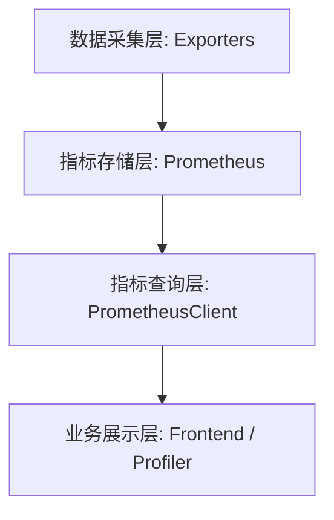

# 资源监控机制

本文档详细介绍了 Crater 平台的资源监控体系，涵盖从底层硬件数据采集到前端业务展示的全链路设计与实现现状。

## 更新记录

> **2026-04-03** | [feat: modify task lifetime to 7 days (#383)](https://github.com/raids-lab/crater/commit/b42eaaea3421c97a1362527ec81e897b405af2ba) | `b42eaae`
> 初始文档创建，详述 Crater 平台的加速卡监控体系架构。涵盖从数据采集层（Exporters）、指标存储层（Prometheus）、指标查询层（PrometheusClient）到业务展示层的全链路设计。重点分析了当前系统从“NVIDIA 深度绑定”向“多厂商全兼容”过渡的阶段性特征，识别了 PromQL 查询硬编码等核心瓶颈，并明确了指标映射机制等未来演进方向。

## 1. 体系架构概述

Crater 的资源监控体系采用分层架构设计，旨在兼容不同厂商的加速卡，并提供统一的监控视角。目前系统正处于从“NVIDIA 深度绑定”向“多厂商全兼容”过渡的阶段。

---

## 2. 各层设计与实现现状

### 2.1 数据采集层 (Data Collection Layer)

**设计初衷**：
通过在每个计算节点部署厂商特定的 Exporter，将底层硬件状态（利用率、显存、温度、计算单元活跃度等）转换为标准的 Prometheus 格式指标。

**实现现状**：
- **NVIDIA 兼容**：通过 `GPU Operator` 自动部署 `dcgm-exporter`。这是目前最成熟的路径，提供了包括基础指标和高阶 Profiling 指标（DCP）在内的全量数据。
- **国产厂商兼容**：架构上支持通过部署 `ascend-exporter` (华为)、`mlu-exporter` (寒武纪) 等接入。
- **现状限制**：目前平台默认配置深度依赖 `dcgm-exporter` 提供的指标命名空间（如 `DCGM_FI_DEV_GPU_UTIL`）。

### 2.2 指标存储层 (Metric Storage Layer)

**设计初衷**：
使用 Prometheus 作为统一的时序数据库，存储所有节点和 Pod 的资源利用率数据，提供高性能的聚合查询能力。

**实现现状**：
- **部署方式**：集成 `kube-prometheus-stack`，作为集群基础监控组件。
- **数据关联**：通过 `ServiceMonitor` 自动发现各厂商 Exporter 暴露的端点。
- **现状限制**：Prometheus 中的指标名称目前主要以 NVIDIA DCGM 标准为主。

### 2.3 指标查询层 (Metric Query Layer)

**设计初衷**：
在后端提供一个通用的 `PrometheusClient` 兼容层，屏蔽不同厂商指标名称的差异，为业务层提供统一的数据结构（如 `PodUtil`, `ProfileData`）。

**实现现状**：
- **代码位置**：`backend/pkg/monitor/`
- **核心逻辑**：通过 `PrometheusInterface` 定义统一的查询接口，如 `QueryPodProfileMetric`。
- **过渡状态特征**：
    - **数据模型已解耦**：定义的 `ProfileData` 结构体包含了 Tensor/FP32/FP16 等通用加速卡指标。
    - **查询逻辑仍绑定**：目前的 PromQL 查询语句中硬编码了 `DCGM_*` 前缀。
    - **存在临时降级**：在 `query.go` 中存在针对特定环境的硬编码节点名称（如 `cn-beijing.10.168.205.227`）作为查询失败时的保底逻辑。

### 2.4 业务展示层 (Business Presentation Layer)

**设计初衷**：
为用户提供直观的作业画像、节点负载展示，并为管理员提供资源利用率分析。

**实现现状**：
- **实时监控**：前端通过 `node-detail.tsx` 等组件调用后端接口，展示 Pod 级别的实时资源占用。
- **任务画像 (Profiler)**：`backend/pkg/aitaskctl/profiler.go` 会在任务执行期间或结束后，通过 `PrometheusClient` 获取一段窗口内的聚合数据，生成任务画像并存入数据库。
- **现状限制**：前端展示逻辑目前主要根据节点的 `VendorDomain` (如 `nvidia.com`) 链接到特定的 Grafana 面板。

---

## 3. 核心演进方向 (过渡期任务)

为了彻底完成多厂商兼容，目前的监控体系需要进行以下改进：

1. **指标映射机制 (Metric Mapping)**：在 `PrometheusClient` 中引入基于 `Vendor` 的指标模板映射，根据节点供应商动态切换 PromQL 语句（例如：NVIDIA 使用 `DCGM_FI_DEV_GPU_UTIL`，昇腾使用 `npu_util`）。
2. **解耦硬编码逻辑**：移除 `query.go` 中的硬编码节点名称和默认值，建立更健壮的错误处理和自动发现机制。
3. **统一画像标准**：推动各厂商 Exporter 提供对齐的计算单元指标（如 Tensor Core 对应指标），确保不同架构下的任务画像具有可比性。

目前世一师兄已经支持了一些国产厂商加速卡的数据展示，但是之后应该还需要增加兼容层，正在考虑在 Crater 中增加兼容层，还是在 Prometheus 中增加兼容层。

## 4. 相关代码索引

- `backend/pkg/monitor/interface.go`: 监控查询接口定义
- `backend/pkg/monitor/query.go`: 具体的 PromQL 查询实现
- `backend/pkg/monitor/struct.go`: 统一的监控数据模型
- `backend/pkg/crclient/nodeclient.go`: 节点供应商 (`VendorDomain`) 识别逻辑
- `backend/deployments/gpu-operator/`: NVIDIA 监控组件部署配置
